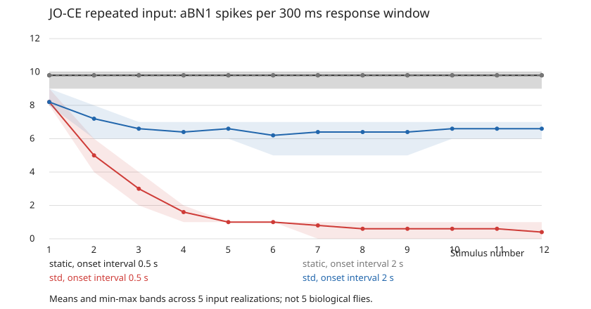

# 首轮实验结果：原模型不递减，局部 STD 足以产生部分特征

完成日期：2026-09-16。**这是神经输出层面的计算实验，不是果蝇行为习惯化的完整复现，也不是新机制的生物学确证。**

## 1. 核心结论

1. **原始固定连接 LIF 在本协议下没有跨次响应递减。** 两种刺激间隔、五种输入实现的 aBN1、aDN1、aDN2 脉冲计数均逐次保持不变。
2. **增加 JO-CE 兴奋性输出突触的秒级资源状态，就足以在 aBN1 产生强递减和休息恢复。** 不需要全脑长期权重训练。
3. **效应明显依赖刺激间隔。** T=0.5 秒出现强递减；T=2 秒的递减弱得多，均未达到本项目预先规定的 30% 筛查门槛。
4. **由此不能推出 STD 是唯一机制，或真实连接组不可替代。** 缺少竞争机制、简单模型/随机图谱对照和真实重复刺激数据。

## 2. 实际完成的实验

- 完整保留上游 127,400 神经元、14,687,178 条聚合连接。
- 70 个 JO-CE 输入神经元；200 ms、150 Hz 等效离散随机驱动。
- 每条序列 12 个脉冲；起始间隔 T=0.5 秒或 2 秒。
- 每次响应窗口 300 ms；末次窗口结束后分叉休息 2/10 秒，再单独探测。
- 两个模型 × 五种输入实现 × 两种间隔 = **20 条完整序列、240 个训练窗口、40 个恢复窗口**。
- M1 仅对 4,764 条 JO-CE 兴奋性输出连接加入 STD：U=0.01、tau_rec=2 秒；没有拟合或扫描参数寻找阳性。
- 两个模型及每次重复刺激使用相同感觉输入；原始脉冲回读进一步确认，同一种子下**感觉神经元实际发放的完整事件序列也相同**。

五个重复是不同随机输入实现，不是不同动物、不同连接组或五组拟合参数。统计量为描述性结果，没有据此进行总体生物学显著性推断。

## 3. 主要读出：aBN1

单位：每个 300 ms 响应窗口的脉冲数，表内为五个输入实现的平均值。

| 模型 | 起始间隔 | 首次响应 | 前3次均值 | 后3次均值 | 平均递减 D | 休息2秒探测 | 休息10秒探测 |
|---|---:|---:|---:|---:|---:|---:|---:|
| M0 固定连接 | 0.5 s | 9.80 | 9.80 | 9.80 | 0% | 9.80 | 9.80 |
| M0 固定连接 | 2 s | 9.80 | 9.80 | 9.80 | 0% | 9.80 | 9.80 |
| M1 局部 STD | 0.5 s | 8.20 | 5.40 | 0.53 | **90.2%** | 5.40 | **8.20** |
| M1 局部 STD | 2 s | 8.20 | 7.33 | 6.60 | **9.9%** | 6.40 | **8.20** |

D 对每个种子分别按 `1 − 后3次/前3次` 计算，再取平均；不是先把全体数值平均后再取比值，也不是相对第一次的降幅。

- M0 每条序列 12 次计数完全恒定：四种输入实现为 10，另一种为 9。
- M1/T=0.5 秒：D 范围 81.25%–100%；5/5 达到递减及 10 秒恢复筛查门槛，5/5 达到平台筛查标准。
- M1/T=2 秒：D 范围 0%–18.18%；0/5 达到递减门槛，4/5 达到平台筛查标准。
- 10 秒恢复的组均值等于该模型初次均值，但**不是每个种子都逐点完全恢复**。短间隔组探测/首次比值为 87.5%–112.5%。
- M1 初次响应已经比 M0 小，说明 STD 不只影响跨次记忆，也会影响单次 200 ms 脉冲内传递；不能隐藏这个基线变化。

图为均值和输入实现间的 min–max 范围，不是生物个体置信区间。原始逐次数据见 [responses.csv](analysis/responses.csv)，逐种子指标见 [metrics_by_seed.csv](analysis/metrics_by_seed.csv)。

## 4. 下游读出揭示的限制

| 模型/间隔 | aDN1 首次→末期均值 | aDN2 首次→末期均值 |
|---|---:|---:|
| M0 / 两间隔 | 2.2 → 2.2 | 3.4 → 3.4 |
| M1 / 0.5 s | 1.2 → 0 | 2.2 → 0 |
| M1 / 2 s | 1.2 → 0.2 | 2.2 → 1.4 |

末期为后 3 次均值，再跨种子平均。M1 的 aDN1 首次响应范围已经只有 0–2 次脉冲，其中一例首次即为零。因此：

- aBN1 的阳性不能自动推广为完整运动行为的习惯化。
- 低计数/地板效应会破坏下游比值和行为阈值解释。
- 下一轮应要求候选机制保留足够的初始下游响应，并设置直接激活/旁路刺激对照；不能把输出失能误认为有选择的记忆。

## 5. 实测了哪些 hallmarks

| 特征 | 当前状态 |
|---|---|
| H1 反应递减 | M1 短间隔的 aBN1 阳性；M0 阴性；长间隔 M1 未达预设效应量门槛 |
| H2 休息恢复 | M1 短间隔阳性；独立末态分支探测，不受前一探测污染 |
| H4(a) 更频繁刺激递减更强 | 两个间隔的描述性比较支持 |
| H4(b) 更频繁训练后恢复更快 | **未建立**：只有两个休息点，末态深度不同，长间隔有一例未过平台标准 |
| H3 多轮习惯化增强、H5 强度依赖、H6 渐近后的继续积累 | 未测试 |
| H7 刺激特异性、H8 去习惯化、H9 去习惯化本身递减 | 未测试；不能用恢复或 JO-F 的低响应代替 |
| H10 长期习惯化 | 未测试，也没有长期机制 |

恢复速度尤其容易误判：`探测/首次` 与 `(探测−末期)/(首次−末期)` 回答不同问题。后者作为看过部分结果后的探索性诊断记录在 CSV，未用于事后增加“通过”项目。当前不估计恢复时间常数，不据稀疏探测宣称已经支持或否定所有 H4(b) 机制。

## 6. 工程与数据验证

### 实际通过

- Pilot 中 M1-zero（U=0）与 M0 的**完整全脑训练脉冲表一致**。
- 三个 pilot 模型各自保存/恢复训练末态后，恢复分支的完整脉冲表重放一致。
- 正式结果独立回读 **60 个原始事件文件**，重算全部 280 个窗口的主/次读出、总脉冲数和感觉神经元计数。
- 五种输入实现内，逐个感觉神经元的相对发放时刻跨模型、重复刺激、间隔和恢复探测完全一致。
- 源数据、协议、历史入口快照与登记输出 SHA-256 验证通过；时间网格、ID 整数精度、重复事件及资源边界检查通过。
- 合并数据既无缺失，也无重复。未完成片段没有进入分析。
- 附加回读显示：登记的正式事件文件中，300 ms 响应窗口之外没有脉冲。这不等于神经变量被重置；变量在连续网络中继续演化。
- 10 项协议/指标/输入测试通过。

输入注入事件与感觉神经元脉冲并非严格一对一：五种输入实现分别注入 2,125/2,080/2,145/2,171/2,094 个事件，实际感觉脉冲为 2,100/2,054/2,109/2,134/2,065。二者都逐次稳定，不能把这一区别写成训练期间输入衰减。

### 执行限制与资源

首次执行达到工具 1,800 秒时限后终止；之后按相同协议分批补完。主运行仍标记 `interrupted`，完整性由三批合并后的覆盖检查确认，不篡改为单次成功。

已完成序列所在的检查点/批次累计约 3,065 秒（51.1 分钟）；包含加载、编译、快照、静默间隔计算和写盘，且不含中断后的未完成片段，不是纯积分 benchmark。首次运行未写出最终 RSS；两次接续的已记录峰值约 2.47 GiB，不能冒充所有批次的确定全局峰值。

详见 [report.json](analysis/report.json) 和 [实验日志](LAB_NOTES.md)。

## 7. 科学解释：现在能说什么，不能说什么

**能说：** 在当前 JO-CE 输入、参数与时间尺度下，原始连接组 LIF 缺少本实验所需的跨次慢记忆效应；添加局部可恢复的资源状态，对产生 aBN1 的递减、恢复及间隔依赖是足够的。本任务不需要先引入大规模学习算法。

**不能说：** 所有固定权重网络都不会习惯化；真实果蝇必定依靠这些 JO-CE 突触的 STD；已经排除外围适应或运动疲劳的全部生物解释；真实全脑结构比小模型更必要；这已是一篇具有新颖机制贡献的完整论文。

这个结果最有价值之处不是“成功造出习惯化”，而是把下一步从泛泛训练大脑收窄为：**如何区分局部耗竭、抑制增强和多时间尺度状态，同时保留正常感觉—运动传递？**

## 8. 下一阶段建议与验收

1. **机制定位与正常功能门槛。** 加入作用于中央候选回路的慢抑制模型，明确哪些边/细胞受到影响；要求初始 aBN1/aDN 响应不是地板值。避免为习惯化牺牲整个传递通路。
2. **真正有区分力的恢复实验。** 在 0.2、0.5、1、2、5、10 秒等时间点从同一末态独立探测，检查渐近状态和损失深度。先在小模型中筛出竞争预测，再消耗全脑计算预算。
3. **特异性、旁路与解除。** 选择能够驱动可比较读出的 B，不直接用在 aBN1 上近乎无效的 JO-F；加入 A→B→A、A→等时休息→A、未训练→B→A 及直接输出驱动对照。
4. **证明连接组是否有用。** 与单状态/双状态最小模型、局部子回路、匹配度数/符号/权重分布的随机图谱比较，在相同数据量下预测留出刺激和干预。
5. **再连接真实实验。** 若目标是生物机制识别，优先补齐嗅觉标注及真实习惯化时间尺度，或对接 JO-CE 重复刺激生理数据。不得以本轮秒级神经输出替代分钟级嗅觉/PER 或 light-off 跳跃数据。

以上是后续建议，尚未执行。本轮到固定协议完成并得到条件性结论为止，没有继续无界调参。
